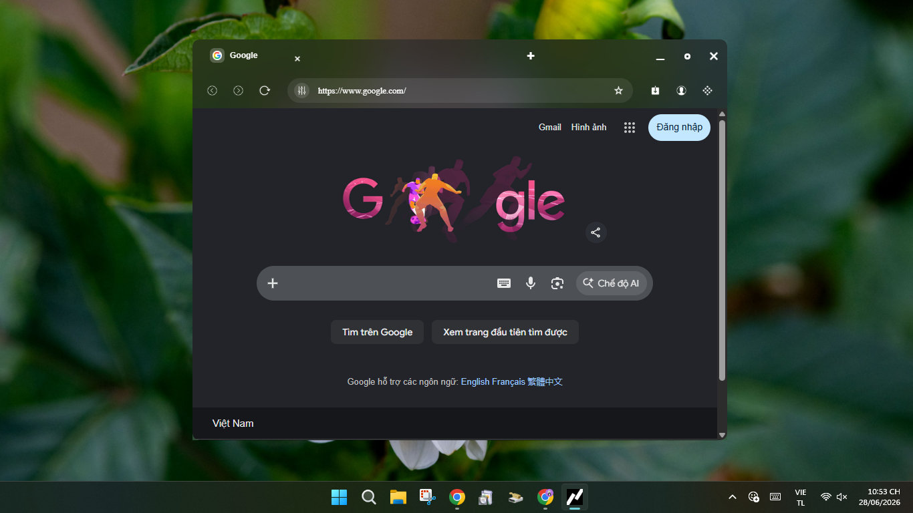

# Unet Browser Beta

Unet is a lightweight, high-performance, and minimal desktop web browser built on top of Electron and webview technologies. Designed with a clean interface and optimized resource management, Unet provides a seamless multi-tab browsing experience without overwhelming system memory.

## Screenshots

Here is a preview of **Unet (v1.64.10)** in action, showcasing its sleek dark interface with elegant acrylic/blur effects:

### Home Page
The main interface displaying the Google home page, integrated beautifully within the custom browser frame.

*(Reference: Ảnh chụp màn hình 2026-06-28 225400.jpg)*

### Browser Menu
A clean, custom context menu providing essential browser controls like New Tab, Downloads, Settings, and Developer Tools.

*(Reference: Ảnh chụp màn hình 2026-06-28 225414.jpg)*

### Web Navigation & Context Menu
Smooth video streaming experience on YouTube along with a native right-click context menu for seamless navigation (Back, Forward, Reload, Inspect).

*(Reference: Ảnh chụp màn hình 2026-06-28 225439.jpg)*

### Loading State
A modern loading indicator featuring the Unet brand logo branding while fetching web content.

*(Reference: Ảnh chụp màn hình 2026-06-28 225626.jpg)*

### Application Information
System installation and version details indicating an optimized bundle size of 359 MB.

*(Reference: Ảnh chụp màn hình 2026-06-28 225754.png)*

## Features

- **Dynamic Multi-Tab System**: Easily open, close, and switch between tabs dynamically.
- **Smart Window Controls**: Custom borderless window design with sleek minimize, maximize, and close functionalities.
- **Optimized Performance**: Engineered to tackle memory leaks and prevent blank screens (`ERR_ABORTED`) during page initialization.
- **Minimalist Navigation**: Clean URL address bar with quick access to essential navigation tools (Back, Forward, Refresh, and Bookmarks).
- **Lightweight Core**: Uses a customized `<webview>` architecture that starts with a single Google homepage to save initial system resources.

## Getting Started

### Prerequisites

Make sure you have [Node.js](https://nodejs.org/) installed on your machine.

### Installation

1. Clone or download this repository to your local machine.
2. Open your terminal in the project directory and install the dependencies:
   ```bash
   npm install

### Running the Application
To launch Unet, run the following command in your terminal: "npm start"

### Tech Stack
1. Framework: Electron
2. Frontend: HTML5, CSS3 (Inter font layout), JavaScript (ES6+)
3. Process Communication: Electron ipcRenderer / ipcMain

### Current Version
1. Developer: Nguyễn Khôi Nguyên
2. GitHub: <NguyenKhoiNguyen-UN>


## 💻 System Requirements

To run **Unet** smoothly, your system must meet the following minimum specifications:

| Component | Minimum Requirement | Recommended Specification |
| :--- | :--- | :--- |
| **Operating System** | Windows 10 (64-bit, Version 1903 or higher) | Windows 11 (64-bit) *for best UI effects* |
| **Processor** | Intel Core i3 / AMD Ryzen 3 or equivalent | Intel Core i5 / AMD Ryzen 5 or higher |
| **Memory (RAM)** | 2 GB RAM | 4 GB RAM or more |
| **Storage** | 500 MB available space | 1 GB available space *(for app & web cache)* |
| **Graphics** | Any standard integrated graphics | DirectX 11 compatible graphics |

> [!CAUTION]
> **Legacy Windows Support:** Windows 7, 8, and 8.1 are **strictly NOT supported** due to modern Electron framework and Chromium core limitations. Running the app on these systems will trigger a *"not a valid Win32 application"* error.


## ⚠️ OS Compatibility & UI Warning

> [!WARNING]
> **Visual Effects (Mica/Acrylic) Compatibility Notice:**
> * **Windows 11:** Fully supported. The application features dynamic Mica and Acrylic blur effects that sync beautifully with your system theme and wallpaper.
> * **Windows 10:** Due to operating system architectural limitations, these advanced blur effects **cannot be rendered**. 
>   * *What happens?* The interface will automatically fallback to a flat, solid dark theme. 
>   * *Why?* This ensures the application remains highly performant, lightweight, and completely free of lag or visual glitches on older Windows environments.

*Note for Windows 11 users: If the transparency effects do not appear, make sure that **Transparency effects** is toggled ON in your OS settings (`Settings > Personalization > Colors`).*


## Download for Windows 
1. You can download ***Unet*** on this link: https://github.com/NguyenKhoiNguyen-UN/Unet/releases
2. You can download ***latest Unet version*** on this link: https://github.com/NguyenKhoiNguyen-UN/Unet/releases/tag/1.64.10
3. You can download ***Unet on tags*** by this link: https://github.com/NguyenKhoiNguyen-UN/Unet/tags

Thank you for exploring Unet Browser! Feel free to submit issues or feature requests.


*ver_latest:1.64.10*
